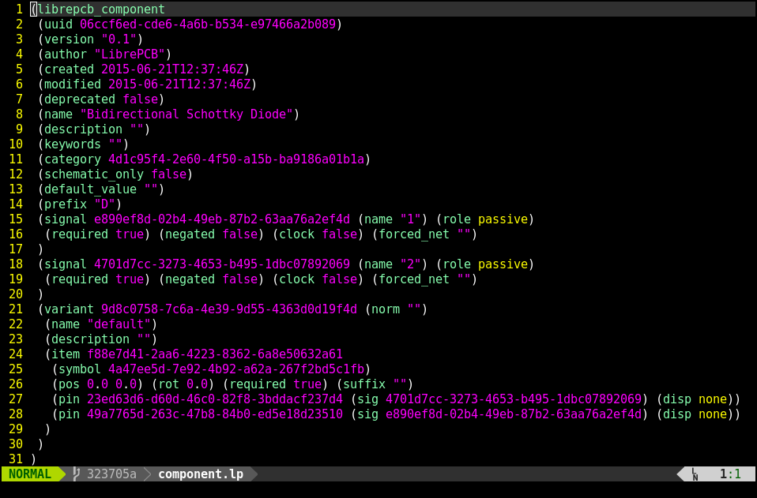

# librepcb.vim

Syntax highlighting for LibrePCB files.

Example (using the default color scheme):



## Installation

### Using [Vundle](https://github.com/VundleVim/Vundle.vim)

Add the following to your `vimrc`
```vimrc
Plugin 'dbrgn/librepcb.vim'
```
